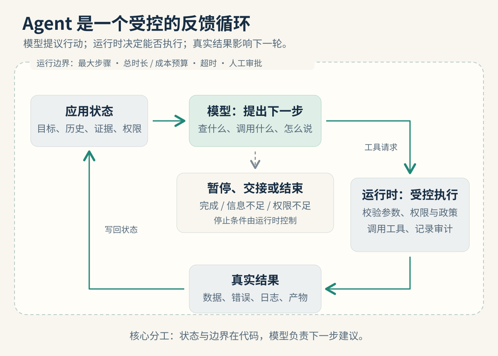

很多 Agent 做到后面失控，问题不一定是模型不够聪明，而是把三件本该分开的事混在了一起：**状态由谁保存、行动由谁提出、风险由谁兜底。**

这篇文章从一份退款审核 Agent 的实战复盘中提炼而来，但讨论的是通用的工程原则。退款、订单和工具名都只是示例；涉及资金、权限或数据写入的系统，必须由真实业务服务负责校验与执行。



## 1. 先理解模型：它不是一个带记忆的业务系统

普通模型接口的一次调用，看到的是你本轮发送给它的上下文。所谓“它记得刚才查过订单”，通常是应用把先前的对话、工具调用和工具结果重新放进了 `messages` 或会话状态。

这带来四个实用结论：

1. **状态在应用里。** 会话历史、任务进度、已查证据、去重标记、预算和权限，都应该由代码或存储系统维护。
2. **模型按当前上下文生成。** 从宏观看，Agent 循环会反复读取整段状态再决定下一步；从微观看，模型在生成下一个 token。这两件事的结构相似，但层级不同。
3. **模型输出是不可信输入。** 即使是结构化工具调用，也要经过解析、参数校验、白名单和业务规则检查。
4. **提示词改变概率，不提供保证。** 它能引导模型少犯错，却不能代替身份认证、金额计算、幂等、审批和事务。

一句话概括：**模型擅长根据语境提出“查什么、怎么说”；代码负责确认“能不能做、怎么安全地做”。**

## 2. Agent 循环不是“自动执行”，而是受控的反馈循环

一个最小的 Agent 循环可以写成下面这样：

```js
for (let step = 0; step < maxSteps; step += 1) {
  const response = await model.respond({ messages, tools });

  if (!response.toolCalls?.length) {
    return validateFinalAnswer(response.text, taskState);
  }

  messages.push(asAssistantToolCallMessage(response));

  for (const call of response.toolCalls) {
    const request = validateToolCall(call, taskState); // 名称、参数、范围
    const result = await executeWithPolicy(request);    // 授权、超时、审计、幂等
    messages.push(asToolResultMessage(call.id, result));
  }
}

return handoff(taskState, '达到最大步骤数');
```

模型只能提出工具调用；执行器决定是否接受，并把成功、失败或“结果未知”写回状态。下一轮模型看到这些结果后，才可能调整路径。

这也是 Agent 和“模型帮你写了一段计划”之间的差别：计划没有进入真实环境时，它只是文本；真实的工具结果被纳入下一次决策时，才形成可验证的闭环。

循环必须由程序提供边界：最大步骤数、总时长、调用预算、重复调用去重、超时、人工审批和明确的停止条件。模型不应自行决定这些边界是否存在。

## 3. 消息与工具协议：细节错了，循环就断了

不同提供商的协议字段会有差异，但以常见的 Chat Completions 风格 Function Calling 为例，关键不是“发出一次请求”，而是**把完整状态按正确关系带回下一轮**：

| 组成 | 作用 | 容易出错的地方 |
| --- | --- | --- |
| `system` | 固定角色、边界与任务规则 | 把业务硬约束只写进提示词 |
| `user` | 当前用户请求 | 把身份、租户等可信上下文交给模型生成 |
| `assistant.tool_calls` | 模型提出的结构化工具请求 | 丢失调用 ID、把参数当作可信对象 |
| `tool` | 某次工具的执行结果 | 没有对应正确的调用 ID，或遗漏失败结果 |
| `messages` | 累积的任务状态 | 只增量拼接，遗漏关键历史或重复同一行动 |

在很多兼容接口中，工具参数表现为 JSON 字符串，工具返回内容也会作为字符串回传；它们要先被应用解析和校验。`tool_call_id` 让某条工具结果能准确对应某次模型请求，不能自行改写或猜测。

如果模型同时请求“查订单”和“查物流”，应用可以并行执行，但仍要分别记录结果，并在下一轮把它们完整带回。不要把调试时看到的普通文本、私有推理字段或展示文案，当成必须继续传回模型的可靠状态。

## 4. 最重要的分工：模型决定“查什么”，代码决定“能不能做”

下面这张表可以直接用来审查一个 Agent 的设计。

| 事项 | 应由谁负责 | 原因 |
| --- | --- | --- |
| 下一步优先查订单、物流还是知识库 | 模型 | 需要根据当前证据判断调查方向 |
| 怎样向用户解释当前结果 | 模型 | 需要理解语境并组织表达 |
| 当前用户能查哪一笔订单 | 代码与鉴权系统 | 这是身份归属和数据隔离问题 |
| 参数是否满足格式、枚举和范围 | 代码 | 这是输入校验问题 |
| 是否符合退款资格、窗口和政策 | 规则服务或代码 | 需要确定性、版本化和可审计性 |
| 金额求和、余额计算、额度限制 | 代码或数据库 | 不能由自然语言推断替代计算 |
| 写操作、审批、幂等与事务 | 代码与业务服务 | 需要可恢复、可追踪且不重复执行 |
| 是否达到运行上限 | Agent 运行时 | 防止无限循环和不可控成本 |

例如，一个退款 Agent 可以说“我会先核实订单状态”；但它不能凭自己一句“符合条件”直接打款。正确做法是让受控工具执行资格核验，将结果返回给模型，再由模型面向用户说明下一步。

## 5. 提示词只是一层软约束

“不要越权”“不要直接退款”写进 system prompt 是必要的，但它只是软约束。长上下文、诱导输入、模型误判或工具描述不清，都可能让这层约束失效。

真正的防线要落在工具与业务层：

- 身份来自可信会话或令牌，并由服务端注入，不让模型填写 `user_id`。
- 工具名称使用白名单；每个工具有独立的参数契约和权限范围。
- 政策判断、金额计算与聚合在代码或 SQL 中完成。
- 写操作默认进入“待人工审批”或显式授权流程，避免模型直接产生不可逆动作。
- 最终文案经过规则过滤或模板化处理，不能把“已到账”“已退款”这类高风险表述原样相信。

模型可以参与解释，不能成为系统的唯一控制面。

## 6. 加工具、加参数，还是接 RAG？

很多“查不到”的问题，并不是 Agent 循环有问题，而是它没有合适的能力。可按下面的方式判断：

| 需求变化 | 更合适的做法 |
| --- | --- |
| 新增业务实体或新动作，例如查商品、查发票 | 新增一个边界清楚的工具 |
| 同一查询只是时间、状态等筛选条件不同 | 给已有工具增加参数，避免拆成很多近似工具 |
| 查询政策原文、FAQ、产品说明 | 使用 RAG 或文档检索 |
| 查询实时私有数据、需要授权、需要聚合或会产生副作用 | 使用受控工具，不能用 RAG 替代 |

工具越多，模型越容易选错，schema 也会占用更多上下文。工具少于十几个时，通常可以直接注册；数量增大后，再考虑按领域分组、路由、动态加载或把工具合并为更合理的参数化接口。

反面例子是做一个“万能查询工具”，允许自由 SQL 或任意资源查询。它把权限、数据范围和审计边界都推给了模型，几乎等于主动制造越权入口。

## 7. 单 Agent、路由和子 Agent，怎么选？

默认先从**单 Agent + 少量工具**开始。领域集中、工具不多、规则一致时，拆分往往只会增加延迟和调试成本。

当请求天然属于不同领域，并且工具、知识库或合规边界不同，例如退款、门锁和账单各自独立，可以先做意图识别与路由：它解决的是“这件事该由谁处理”。

子 Agent 解决的是另一件事：主 Agent 把一块可独立完成的任务委托出去，再接收摘要或结构化结果。它适合以下情况：

- 中间工具结果很多，不希望污染主任务上下文；
- 多个独立子任务可以并行；
- 研究、资金操作等职责需要隔离权限；
- 某个专业能力需要被多个上层流程复用。

路由通常是横向选择；子 Agent 是纵向委托。二者可以一起使用，但不应该因为“多 Agent”听起来更高级，就把一个简单任务硬拆成多个循环。

## 8. 从演示走向生产，要补上的检查清单

一个本地演示可以用内存 Mock、硬编码规则和简单重试跑通流程；生产系统则至少需要补齐下面这些能力。

| 维度 | 生产要求 |
| --- | --- |
| 密钥与配置 | 使用密钥管理服务或环境注入，轮换并避免日志泄漏 |
| 数据与写入 | 真实数据源、数据库唯一约束、事务、持久化审计 |
| 身份与授权 | 服务端鉴权、最小权限、数据范围绑定到可信身份 |
| 工具执行 | 参数约束、超时、限流、异常分类和可观测调用记录 |
| 重试 | 仅对可恢复错误谨慎重试；写操作依赖幂等键，超时先查状态 |
| Agent 循环 | 步骤、时长和费用预算；重复调用检测；最终结果二次验证 |
| 输出与运营 | 统一异常处理、结构化日志、指标、追踪和人工接管入口 |

退款这一类资金流程还应把“模型建议”与“业务执行”拆开：模型可帮助搜集信息、解释政策和提出下一步；最终写入必须经过业务服务、授权与审计通道。

## 结语

Agent 的价值不在于给模型更多“自由”，而在于把模型的灵活判断放入可验证、可控制的系统中。

记住这条分工就够了：**状态在代码里，判断在代码里，模型负责查什么、怎么说。**

当你能回答“这次工具调用为什么发生、谁授权、结果如何验证、失败后如何停止”时，你构建的就不只是一个会调用工具的聊天框，而是一个可以逐步走向生产的 Agent。

---

本文根据《模型与 Agent 开发原理》PDF 的实战复盘整理，已将具体接口与项目实现改写为通用工程模式。更新于 2026 年 9 月 29 日。
