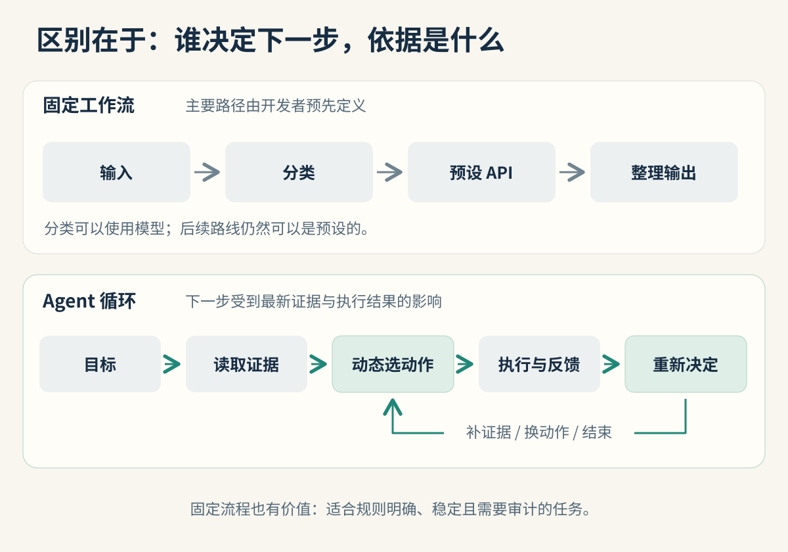
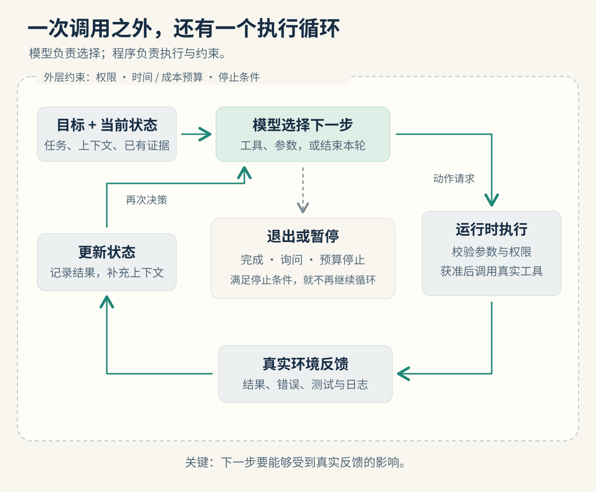
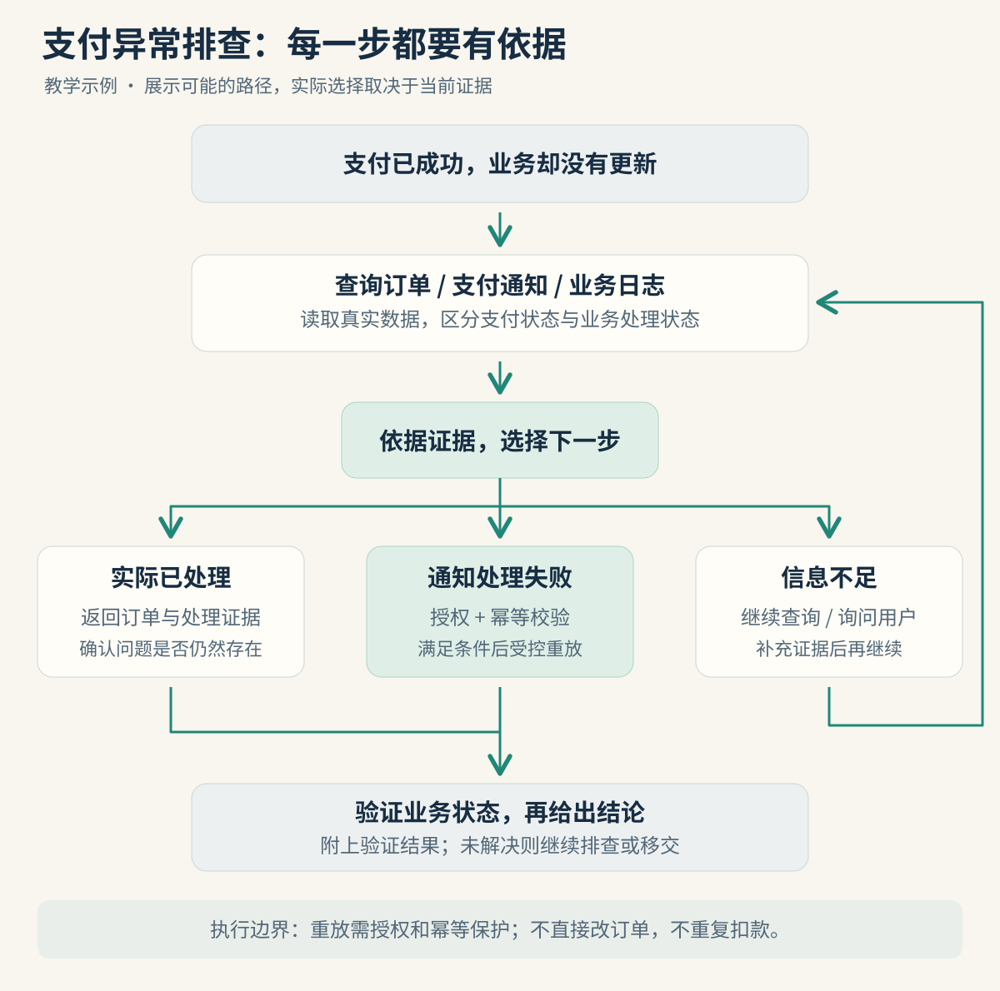

我判断一个系统有没有 Agent 能力，首先看一件事：**执行到一半，发现情况与预期不同时，它能否根据真实反馈，决定下一步该做什么。**

这也是 Codex 这类编程 Agent 最值得拆解的地方：它可以读取项目、修改代码、运行检查，再根据报错继续排查。结果会影响后续行动，而不只是出现在最后的回答里。

不过，“有决策能力就是真 Agent”还需要再说精确一点。分类器会选分支，脚本会重试，模型会写计划，这些现象本身都不能证明系统具备完整的自主执行能力。

本文讨论的是 **LLM 驱动的任务型 Agent**。我采用的工程判据是：模型围绕目标，在运行时选择行动，并把执行反馈纳入后续决策。“假 Agent”指能力宣传超出实际机制的包装，不是行业认证术语，也不是对所有工作流的否定。

## 1. 最关键的区别：谁在决定下一步？

把一个系统拆开看，至少要区分两个层面：

- **执行框架**：什么时候请求模型、怎样执行工具、最多运行几轮。它通常由程序规定。
- **任务路径**：当前该查什么、用哪个工具、要不要换方法、什么时候结束。它可以由固定规则规定，也可以交给模型动态选择。

Agent 也运行在程序写好的循环里。因此，“底层都是代码”不能用来否定它。真正要看的是，代码是否允许模型根据当前证据，控制任务的后续路径。

Anthropic 的架构分类提供了一个有用参照：workflow 主要依靠预设代码路径编排，agent 则由模型动态引导过程与工具使用；它也承认 Agent 有多种定义。[来源：Building effective agents](https://www.anthropic.com/engineering/building-effective-agents)



| 系统结构 | 主要由谁控制任务路径 | 能说明什么 |
| --- | --- | --- |
| 提示词模板 → 模型回答 | 开发者规定一次生成 | 有语言生成能力 |
| 固定检索 → 拼接资料 → 回答 | 检索流水线 | 有知识增强能力 |
| 分类 → 预设分支 → API → 总结 | 分类结果加既定流程 | 有路由和自动化能力 |
| 模型选一个工具 → 执行 → 结束 | 模型只获得局部选择权 | 有工具选择能力，尚不能证明持续自主执行 |
| 目标 → 选行动 → 执行 → 观察 → 再决策 | 模型在约束内持续选择 | 具备本文讨论的 Agent 闭环 |

这些结构可以组合。一个业务系统完全可以在固定流程里嵌入 Agent，也可以让 Agent 调用一段确定的工作流。

## 2. 拆开一个 Agent，里面到底有什么？

从实现角度，可以把它理解为下面这套协作关系：

> 模型提出下一步行动，运行时负责校验和执行，环境返回事实，模型再利用这些事实作出下一次选择。



| 部件 | 开发时要解决的问题 | 支付排障中的例子 |
| --- | --- | --- |
| 目标与验收条件 | 到什么状态才算完成？ | 查明业务未更新的原因，并给出证据或验证修复结果 |
| 上下文与任务状态 | 已经知道什么，还缺什么？ | 订单号、查过的日志、失败调用、待验证假设 |
| 模型决策 | 此刻最有价值的下一步是什么？ | 查支付状态、查通知记录，还是补充订单信息 |
| 工具接口 | 能读什么、能做什么？ | 查询订单、读取日志、调用受控的通知重放接口 |
| 运行时 | 如何让调用可靠且受约束？ | 参数校验、权限、超时、调用预算和执行记录 |
| 验证与退出 | 如何区分完成、失败和等待？ | 确认业务状态；信息不足时询问；达到上限时交接 |

**模型决定调用，不等于模型亲自执行。** 以自定义 Function Calling 为例，模型输出工具调用请求，应用执行对应代码，再把结果交回模型；模型可能据此回答，也可能继续请求工具。[来源：OpenAI Function calling](https://developers.openai.com/api/docs/guides/function-calling)

同样，任务状态不一定需要向量数据库。最初可以只是对话记录、工具结果和一个结构化状态对象。跨会话长期记忆是可选能力；当前任务里保留了哪些证据，往往更直接影响下一步判断。

开发者还要区分 **“有 Agent 结构”与“Agent 做得可靠”**。一个会错误选工具的系统仍可能有自主决策；但要用于真实业务，还需要权限、验证、可追踪记录和清楚的退出条件。

## 3. 用支付排障，看见决策发生在哪里

设想一个教学场景：用户反馈“已经付款，但业务订单一直没更新”。以下工具、订单和执行轨迹均为说明原理的设计示例，不代表某个支付平台的真实接口。

一个固定流程可能会这样做：提取订单号，查询订单，匹配状态，返回预设处理建议。如果异常类型有限、处理规则明确，这套方案已经很实用。

当情况变复杂时，任务型 Agent 的作用会更明显。它先查证，再根据新证据决定调查方向：

- 支付侧未确认成功：继续核实交易，不能仅凭用户描述认定已付款。
- 支付成功，商户通知失败：检查失败原因，判断是否满足受控重放条件。
- 通知已到达，业务消费报错：转向业务日志和消费记录。
- 业务已经处理：返回当前状态和证据，避免重复执行。
- 订单标识不完整：向用户补充询问，而不是猜一个订单继续操作。



图中的分支只是几条可能路径，**画出这张图本身还不等于实现了 Agent**。如果开发者把每条分支写死，由规则引擎选择，它仍是工作流；如果模型基于证据决定下一项调查，并能在允许的工具范围内调整路线，才体现了这里讨论的自主决策。

下面是一段示意执行记录：

```text
目标：查明订单为什么没有更新
查询支付状态 → 已成功
查询通知记录 → 商户端返回处理错误
读取业务日志 → 消息消费失败，修复已部署
选择下一步   → 申请执行已定义的通知重放操作
运行时校验   → 授权有效，目标匹配，满足幂等约束
执行重放     → 接口返回已受理
再次查询     → 业务状态已更新，存在对应处理记录
结束         → 返回原因、执行记录与验证结果
```

这里有两个关键点：一是“读取业务日志”由前面的反馈触发；二是“已受理”没有直接被当作“业务已修好”，系统还查询了最终状态。

真实实现里，重放应走已有业务接口，依赖服务端的鉴权与幂等保护；写操作响应超时，可能是结果未知，不能当成未执行直接重试。自主判断要在这些业务约束内运行。

## 4. 为什么 Codex 是一个直观的例子？

以“修复一个测试失败”为例，一次可能的过程是：读取相关代码 → 运行测试 → 发现字段不匹配 → 修改实现 → 重跑检查 → 根据新的失败继续调整。这条具体路线会受到仓库内容和执行结果影响。

OpenAI 对 Codex 的说明强调了这种计划、修改、执行工具、观察和修复的循环，以及错误、差异和日志提供的真实反馈。[来源：Run long horizon tasks with Codex](https://developers.openai.com/blog/run-long-horizon-tasks-with-codex)

让这一过程持续运行的外围系统常被称为 **harness**，可以理解为“承载模型执行任务的运行框架”。Codex 的这层系统负责会话状态、工具执行、进度事件，以及配置的沙箱和审批策略。[来源：Codex as a platform](https://developers.openai.com/blog/codex-as-a-platform)

所以，判断类似产品时，可以直接看：工具的失败有没有被识别？后续行动有没有改变？最终结果有没有可检查的依据？屏幕上的“正在思考”文字本身不能回答这些问题。

Codex 也可能判断错误、提前结束或遇到权限限制。是否有自主决策、能否稳定完成任务、是否允许执行某个操作，是三个不同的问题。

## 5. 一个最小 Agent 循环，可以怎么写？

下面是**框架无关的伪代码**，只展示控制关系。其中的方法代表需要自行实现的业务接口，不是某个 SDK 可直接运行的示例。

```python
state = new_task(goal, constraints, acceptance_criteria)

for step in range(MAX_STEPS):
    if deadline_or_cost_limit_reached(state):
        return handoff(state, reason="达到时间或费用上限")

    decision = model.choose_next(state, available_tools)

    if decision.kind == "ask_user":
        return pause_with_question(state, decision.question)

    if decision.kind == "finish":
        check = verify_goal_against_evidence(state)
        if check.passed:
            return report_with_evidence(state)
        state.add_observation(check)
        continue

    # 工具名、参数、目标范围和权限，由运行时校验
    call = validate_tool_request(decision, available_tools)
    if not call.valid:
        state.add_observation(call.error)
        continue

    if not permitted(call, state.authorization):
        return pause_for_authorization(state, call)

    # 执行器返回成功、失败或结果未知；写操作不盲目重试
    result = execute_with_timeout_and_idempotency(call)
    state.record(call, result)
    # 下一轮模型能看到本轮结果，再选择下一步

return handoff(state, reason="达到迭代上限")
```

最值得注意的是 `state.record(call, result)` 与下一轮 `model.choose_next(...)` 的连接。只执行工具、不把结果交回后续决策，闭环就缺了一段。

`verify_goal_against_evidence` 也不能只是让同一个模型口头保证完成。验收可以包含测试结果、接口查询、产物检查；遇到无法程序化验证的要求，则需要恰当的人工判断。暂停时也要保存状态，才能在授权或补充信息后继续。

初版可以先做一个目标清晰的单 Agent，提供少量边界明确的工具，再逐步补齐状态管理、异常处理和评估。是否拆成多 Agent，应该由实际任务需要决定。

## 6. 常见“假 Agent”包装，通常是怎么组成的？

这里拆解的是可观察的架构模式，不对未实测的具体产品下结论。关键在于：**它实际能做的事，是否足以支撑它声称的自主能力。**

| 看起来像 Agent 的包装 | 可能的实际构成 | 应该追问什么 |
| --- | --- | --- |
| “专属行业专家” | 角色提示词 + 模型回答 | 能采取行动，还是只能生成建议？ |
| “企业知识智能体” | 文档切片 + 检索 + 提示词拼接 | 检索不到时能否调整调查，还是照样给答案？ |
| “自动办理业务” | 意图分类 + 固定 API 分支 + 总结 | 情况偏离预设时，下一步由谁决定？ |
| “会自我反思” | 固定次数的生成、评价或重试 | 反馈改变了行动策略，还是只重写同一段话？ |
| “多 Agent 团队” | 几个人设按顺序接力输出 | 谁管理目标，谁验证结果，谁决定重新分工？ |
| “展示完整思考过程” | 进度文案或模型生成的计划 | 是否存在对应的真实调用与结果记录？ |

这张表不是说 RAG、路由、评价循环或多 Agent 本身是假的。它们可以是优秀的独立方案，也可以成为 Agent 的组成部分。问题出现在：实际只有这些组件，却被宣传成能自主完成任意复杂任务。

还有一个容易误判的边界：某次运行只调用了一个工具，也可能是合理的 Agent 行为，因为目标已经完成。要判断的是系统具备怎样的控制能力，而不是强迫它每次都多跑几轮。

## 7. Coze、Dify 算不算真正的 Agent？

要看你在平台里搭建了什么，以及它实际如何执行。

Dify 的 Agent 节点允许模型迭代选择工具和调用时机，也能作为工作流中的一步。这说明“外层有工作流”与“内部有自主决策”可以同时成立。[来源：Dify Agent 节点](https://docs.dify.ai/en/cloud/use-dify/nodes/agent)

Coze 的官方说明也区分了自主规划模式与固定对话流模式。产品名称相同，不代表每种模式的控制方式相同。[来源：Coze 对话流模式](https://docs.coze.cn/guides_chatflow_mode)

例如，前面支付场景可以采用这样的混合设计：身份和参数校验由固定流程完成；异常调查交给 Agent；需要写入时走受控业务接口；最后再查询结果。业务约束与灵活调查各自承担明确职责。

因此，低代码还是手写代码、有没有节点画布，都不是判断自主能力的标准。真正要检查的是节点之间，以及节点内部的决策和反馈机制。

## 8. 如何验收，而不是听它自我介绍？

比起问产品“你是不是 Agent”，我更愿意给它几组受控变化，观察执行记录：

| 测试变化 | 观察重点 |
| --- | --- |
| 工具返回“没有数据” | 是否承认信息缺口，调整查询或询问用户 |
| 同一目标出现另一种故障 | 是否依据新证据改变调查路径 |
| 写接口返回超时 | 是否识别结果未知，先查状态再决定行动 |
| 验证不通过 | 是否继续修正，或明确报告无法完成 |
| 权限不足或预算用尽 | 是否停止、保存进度并清楚交接 |

这些测试也不是一次性的“真假鉴定”：精心编写的工作流同样能通过部分测试。要结合多种任务的工具调用、结果反馈和控制逻辑，看清决策究竟发生在哪一层。

观察记录不需要索取模型的隐藏思维链。工具名称、关键参数、返回结果、产物变化和简短的行动理由，已经可以提供很多可核验的信息。

评估时再看任务完成率、错误操作、耗时和费用。自主程度越高，不代表每个场景都越划算：固定规则能稳定解决的问题，就让规则完成；需要临场调查和调整路径的部分，再交给 Agent。

对我来说，“真正的 Agent”最有说服力的证据，是它在出现新情况后，能沿着反馈继续推进目标，并准确告诉我做到了什么、还差什么。

---

资料核对于 2026 年 9 月 18 日。文中的支付案例、伪代码和图解为教学设计；产品机制以正文链接的官方资料为依据。
